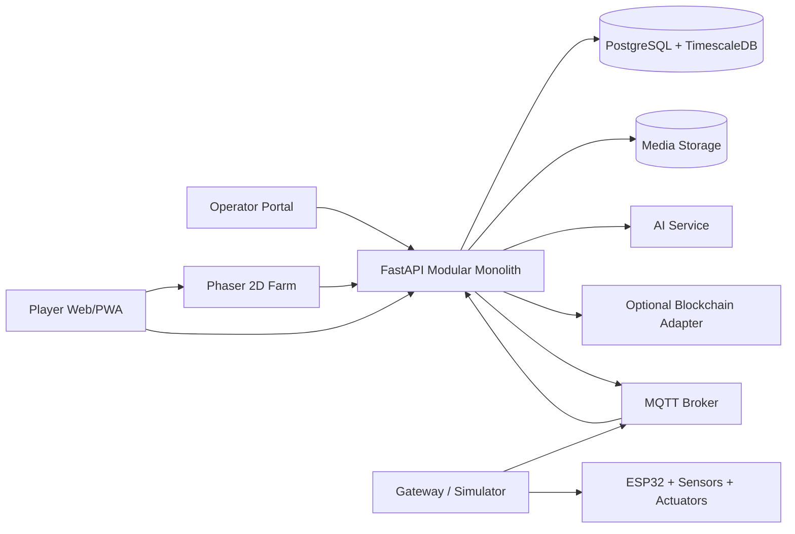

# Architecture

## Decision summary

The MVP uses a modular monolith backend, a separate AI service, a web/PWA frontend with Phaser, PostgreSQL/TimescaleDB, MQTT, and a mandatory hardware simulator.

Blockchain is isolated behind an interface and disabled by default.

## High-level architecture



## Backend modules

The backend contains the FastAPI application and backend-adjacent services.

```text
backend/
  app/                 # FastAPI modular monolith
  alembic/             # database migrations
  services/
    simulator/         # mandatory MQTT simulator
    gateway/           # real IoT gateway bridge
    firmware/          # ESP32 firmware workspace
    ai-service/        # separate AI inference runtime
```

The FastAPI application is one deployable application with explicit internal modules:

- `auth`
- `users`
- `farms`
- `plots`
- `crop_catalog`
- `leases`
- `crop_cycles`
- `telemetry`
- `automation`
- `player_actions`
- `work_orders`
- `care_logs`
- `media`
- `incidents`
- `harvests`
- `deliveries`
- `notifications`
- `traceability`
- `admin`

Modules communicate through application interfaces and domain events, not direct table coupling.

## Why modular monolith

The team is small, the schedule is short, and most business rules are still evolving. A modular monolith reduces deployment and debugging cost while preserving boundaries for later extraction.

The AI service remains separate at runtime because model runtime, dependencies, and scaling differ from transactional business logic. It lives under `backend/services/ai-service` in the repository because it is owned by the backend/automation side of the platform.

## Realtime behavior

- Telemetry enters through MQTT.
- The API validates and stores measurements.
- Web clients receive selected updates through WebSocket or Server-Sent Events.
- Commands are published through MQTT.
- The gateway sends acknowledgements and final state.
- The UI does not mark an action complete before final acknowledgement or work-order completion.

## Durable asynchronous work

Use database-backed durable jobs for MVP:

- AI inference retry;
- media processing;
- notification delivery;
- traceability hash generation;
- optional blockchain anchoring.

Do not add Redis, Kafka, or a separate queue platform until an ADR shows a real need.

## Data stores

- PostgreSQL: transactional domain data.
- TimescaleDB hypertables: telemetry.
- Object storage or local development storage: images and evidence.
- Optional blockchain: hash anchors only.

## Deployment

Local development should run with Docker Compose. The simulator must support the same MQTT topics and payloads as the real gateway.
