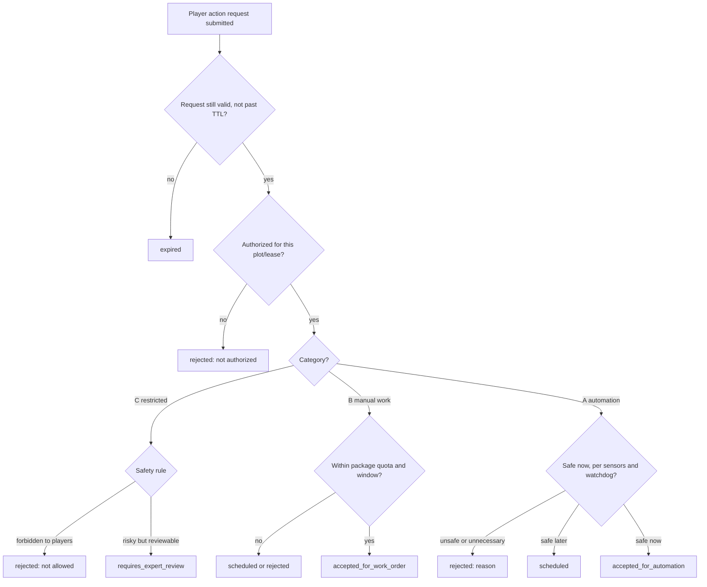

# Action Catalog

> Week 1 deliverable for issue #3 (`role:khoa`). This document is the authoritative
> list of player action requests and their expected policy outcomes. It feeds the
> policy engine in the `player_actions` and `automation` modules.
>
> Read alongside: `docs/02_BUSINESS_RULES.md` (Player actions, Automation),
> `docs/04_DOMAIN_MODEL.md` (`PlayerActionRequest`), `docs/06_USER_JOURNEYS.md`
> (Journeys B, C, D), `docs/adr/0003-policy-controlled-player-actions.md`,
> and the `packages/contracts/schemas/player-action-request.v1.json` contract.

Normative keywords `MUST`, `SHOULD`, and `MAY` follow `docs/02_BUSINESS_RULES.md`.

## 1. Core principle

A player action is a **request**, never a direct actuator command (ADR-0003). Every
request is evaluated by an **action policy** that returns exactly one outcome and a
human-readable reason.

```text
Player request
  → policy evaluation (inputs below)
  → one outcome + reason
  → automation command | work order | schedule | expert review | rejection | expiry
```

## 2. Policy outcomes

The policy result MUST be one of the following six values (matches the
`PolicyOutcome` enum in `player_actions/api/schemas.py`):

| Outcome | Meaning | Downstream effect | Owner module |
|---|---|---|---|
| `accepted_for_automation` | Safe to execute automatically now | Creates an `AutomationCommand` (with idempotency key, watchdog limit) | `automation` |
| `accepted_for_work_order` | Needs a human on-site | Creates or joins a `WorkOrder` item | `work_orders` |
| `scheduled` | Valid but deferred to a future window | Queued for the next safe/operator window, re-evaluated then | `player_actions` |
| `rejected` | Not permitted or unsafe right now | No side effect; reason returned to player | `player_actions` |
| `requires_expert_review` | Risk/ambiguity needs an agronomy expert | Routed to expert queue before any execution | `player_actions` |
| `expired` | Request TTL passed before evaluation/execution | Terminal; player may resubmit | `player_actions` |

Every outcome MUST include a human-readable `reason`. The policy version and inputs
MUST be recorded (ADR-0003 consequence; `docs/05_ACTORS_AND_PERMISSIONS.md`
System Automation).

## 3. Action categories

Actions are grouped by how far a player is allowed to drive them:

- **A — Automation-eligible:** the policy MAY execute automatically within safe limits.
- **B — Manual-work:** requires an operator; always becomes a work order.
- **C — Restricted / safety-sensitive:** a player MUST NOT drive these directly;
  they require expert review and/or an authorized operator, or are rejected.
- **D — Handled by another module:** listed for completeness; not evaluated by the
  IoT/automation policy engine (commerce or media flows).

## 4. Catalog

`actionType` is the stable string sent in `player-action-request.v1.actionType`.
Codes are lower_snake_case and MUST stay in English (`AGENTS.md` §5).

### 4.1 Category A — Automation-eligible

| actionType | Player label | Default outcome | Other possible outcomes | Policy inputs | Parameters | Safety constraints |
|---|---|---|---|---|---|---|
| `request_extra_watering` | "Request extra watering" | `accepted_for_automation` | `scheduled`, `rejected`, `expired` | soil moisture, recent irrigation history, crop stage, weather, actuator/watchdog state | `durationSeconds` (server-capped), `zone?` | Duration capped server-side by watchdog; rejected if soil already moist or recently watered (Journey B) |
| `skip_scheduled_watering` | "Skip next watering" | `accepted_for_automation` | `rejected`, `expired` | current soil moisture, safety need for water | `cycleRef?` | Rejected/overridden if emergency automation determines water is required (safety overrides preference) |
| `adjust_ventilation` | "Ventilate / cool plot" | `accepted_for_automation` | `scheduled`, `rejected`, `expired` | air temperature, air humidity, device safety | `mode` (`on`/`auto`), `durationSeconds?` | Only within safe climate range; duration capped by watchdog |
| `toggle_grow_light` | "More light" | `accepted_for_automation` | `rejected`, `expired` | light sensor (if present), photoperiod rules, hardware availability | `durationSeconds` | Optional hardware (pH/light are optional per scope); rejected if hardware absent |
| `request_camera_snapshot` | "Take a photo now" | `accepted_for_automation` | `rejected`, `scheduled` | plot authorization, permitted time window, rate limit, camera online state | none | Camera offline → return last valid image + offline state; rate-limited (Camera & privacy rules) |

### 4.2 Category B — Manual-work (always a work order)

| actionType | Player label | Default outcome | Other possible outcomes | Policy inputs | Resulting `taskType` | Notes |
|---|---|---|---|---|---|---|
| `request_pest_inspection` | "Request pest inspection" | `accepted_for_work_order` | `scheduled`, `requires_expert_review`, `rejected`, `expired` | service-package request quota, request timing, operator window | `pest_inspection` | Batched with compatible requests (Journey C) |
| `request_general_inspection` | "Request a health check" | `accepted_for_work_order` | `scheduled`, `rejected`, `expired` | package quota, request timing | `general_inspection` | Customer-safe result only |
| `soil_nutrient_check` | "Check soil / nutrients" | `accepted_for_work_order` | `requires_expert_review`, `scheduled`, `expired` | package quota, sensor availability | `nutrient_check` | Expert review when readings imply treatment |
| `request_manual_watering_visit` | "Ask staff to water manually" | `accepted_for_work_order` | `scheduled`, `rejected`, `expired` | automation availability, package quota | `manual_watering` | Fallback when automation is unavailable |

### 4.3 Category C — Restricted / safety-sensitive

Per `docs/02_BUSINESS_RULES.md`, player requests MUST NOT directly control pesticide
use, destructive pruning, crop removal, or unsafe actuator duration.

| actionType | Player label | Default outcome | Other possible outcomes | Rationale |
|---|---|---|---|---|
| `request_pruning` | "Request pruning" | `requires_expert_review` | `accepted_for_work_order`, `rejected` | Destructive; must be approved by expert and performed by an operator. Never automation. |
| `request_treatment` | "Report an issue / request treatment" | `requires_expert_review` | `rejected` | Chemical treatment MUST be entered by an authorized operator; player cannot set pesticide/fertilizer dosage. Interpreted as a flag for expert, not a dosing command. |
| `request_early_harvest` | "Harvest my plot now" | `rejected` | `requires_expert_review` | Harvest is biology- and operator-controlled at `awaiting_harvest`; a player cannot force it. |
| `request_crop_change` | "Change my crop" | `rejected` | `requires_expert_review` | Crop selection is immutable after the crop-cycle lock point; requires cancellation or a new crop cycle. |

### 4.4 Category D — Handled by other modules (not the IoT policy engine)

| actionType | Player label | Handling module | Notes |
|---|---|---|---|
| `request_pickup` | "Pick up my harvest" | `deliveries` | Post-harvest commerce flow (Journey E), not IoT policy. |
| `request_delivery` | "Request delivery" | `deliveries` | Same as above. |
| `report_problem` | "Report a problem" | `incidents` | Creates an `Incident`; may spawn a work order or expert review (Journey D). |

## 5. Policy decision flow (high level)



## 6. Contract alignment

- Request payload: `packages/contracts/schemas/player-action-request.v1.json`.
- `actionType` values in this catalog are the allowed set; unknown types MUST be
  `rejected` with a clear reason.
- `parameters` shapes above are proposals for Week 2 contract refinement; the base
  contract keeps `parameters` as a free object for now.
- `idempotencyKey` MUST be honored so retried requests do not create duplicate
  commands or work orders (`AGENTS.md` §8).

## 7. Open questions (for cross-review with Học / Bảo)

Tracked against `docs/13_ASSUMPTIONS_AND_OPEN_QUESTIONS.md`:

1. Which exact actions are in the MVP demo set vs. post-MVP? (Agriculture section)
2. How many manual requests are included per service package, and are extras
   chargeable? (Commercial model) — affects quota logic for Category B.
3. Are pesticides allowed in the demonstration at all? If not, `request_treatment`
   is always `rejected` for the demo. (Agriculture)
4. Should `request_camera_snapshot` go through the policy engine or the `media`
   module directly? (Ownership boundary — Bảo/Học)
5. What is the request TTL before `expired`, and the schedule window granularity?
