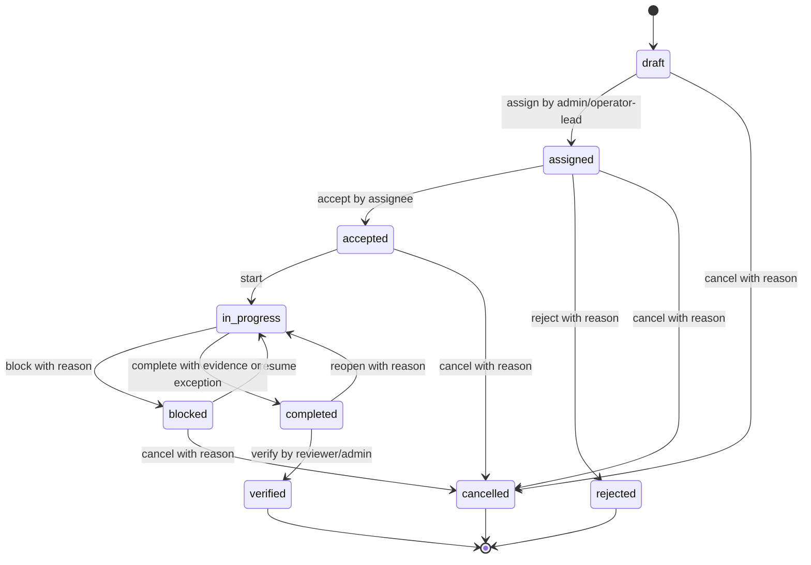

# Operator Workflow — Work Order Lifecycle

> Week 1 deliverable for issue #3 (`role:khoa`). This document defines the work-order
> lifecycle at the documentation level. It feeds the `work_orders` module and the
> operator portal.
>
> Read alongside: `docs/02_BUSINESS_RULES.md` (Work orders), `docs/04_DOMAIN_MODEL.md`
> (`WorkOrder`), `docs/05_ACTORS_AND_PERMISSIONS.md` (Farm Operator, Agronomy Expert,
> Administrator), `docs/06_USER_JOURNEYS.md` (Journey C), `docs/15_ACTION_CATALOG.md`,
> and `packages/contracts/schemas/work-order.v1.json`.

Normative keywords `MUST`, `SHOULD`, and `MAY` follow `docs/02_BUSINESS_RULES.md`.

## 1. What a work order is

A **work order** represents real manual agricultural work. Every manual farm task MUST
be traceable to a work order (`AGENTS.md` §2). A work order groups one or more **items**,
each bound to exactly one `plotId` + `cropCycleId` and an optional `sourceRequestId`
linking it back to the player action request that created it.

## 2. How a work order is created

| Source | Trigger | Initial state | Notes |
|---|---|---|---|
| Player action request | Policy returns `accepted_for_work_order` (see `15_ACTION_CATALOG.md`) | `draft` | Item carries `sourceRequestId` |
| Scheduled manual task | Operator/admin plans routine care | `draft` | No `sourceRequestId` |
| Incident follow-up | An `Incident` requires on-site action (Journey D) | `draft` | Linked to the incident |
| System automation draft | Automation proposes a manual task (e.g., failed command) | `draft` | System actor creates a **draft only**; a human assigns it |

The System Automation actor MAY create work-order **drafts** but MUST NOT erase human
accountability; a human assigns and completes them (`docs/05_ACTORS_AND_PERMISSIONS.md`).

## 3. State machine

States and priority match `packages/contracts/schemas/work-order.v1.json`.

```text
draft → assigned → accepted → in_progress → completed → verified
```

Alternative terminal / exception states: `rejected`, `cancelled`, `blocked`.



## 4. Transition rules

| From | To | Action | Actor (role) | Guard / precondition | Side effects |
|---|---|---|---|---|---|
| `draft` | `assigned` | assign | admin / operator-lead | assignee is an available operator | set `assigneeId`, `dueFrom`/`dueTo` |
| `draft` | `cancelled` | cancel | admin | — | record reason |
| `assigned` | `accepted` | accept | assigned operator | actor == assignee | timestamp accept |
| `assigned` | `rejected` | reject | assigned operator | reason provided | free for reassignment |
| `assigned` | `cancelled` | cancel | admin | — | record reason |
| `accepted` | `in_progress` | start | assigned operator | — | timestamp start |
| `in_progress` | `blocked` | block | operator | reason provided | notify admin |
| `blocked` | `in_progress` | resume | operator | blocker cleared | — |
| `in_progress` | `completed` | complete | assigned operator | evidence present **or** explicit evidence exception | attach `WorkEvidence`, care log |
| `completed` | `verified` | verify | reviewer / admin | evidence or approved exception reviewed | close item; update traceability |
| `completed` | `in_progress` | reopen | reviewer | quality/evidence insufficient | record reason |
| any active | `cancelled` | cancel | admin | — | record reason; player informed if visible |

Invalid transitions MUST be rejected explicitly (`docs/08_CODING_STANDARDS.md`) — e.g.
`COMMAND`/state errors map to HTTP `409` (`docs/API_GUIDELINES.md`).

## 5. Evidence policy

- Completion SHOULD include before/after evidence (`docs/02_BUSINESS_RULES.md`).
- Missing evidence requires an **explicit reason** and **reviewer approval** (evidence
  exception). The error code `WORK_ORDER_EVIDENCE_REQUIRED` (`docs/08_CODING_STANDARDS.md`)
  guards a `complete` without evidence and without an approved exception.
- Evidence metadata SHOULD be integrity-protected where practical
  (`docs/12_SECURITY_AND_PRIVACY.md`, `SECURITY.md`).

## 6. Priority and due window

| Priority | Typical use | Effect on scheduling |
|---|---|---|
| `urgent` | Safety / crop-loss risk, emergency follow-up | Jump the queue; assign immediately |
| `high` | Time-sensitive care, expert-flagged | Assign within the same operator window |
| `normal` | Standard inspection / care request | Batched into the next window |
| `low` | Optional / cosmetic | Filled when capacity allows |

`dueFrom` / `dueTo` define the target window. SLA per priority is an open question
(§9).

## 7. Batching

Work orders MAY combine compatible requests across plots to reduce operational cost
(`docs/02_BUSINESS_RULES.md`). A batching rule SHOULD group items that share:

1. the same `taskType` (e.g., `pest_inspection`);
2. the same farm / greenhouse (physical proximity);
3. an overlapping due window;
4. compatible priority (do not delay an `urgent` item to batch it).

Each batched item keeps its own `plotId`, `cropCycleId`, and `sourceRequestId`, so
per-plot traceability and per-player customer-safe status remain intact.

## 8. Player-visible (customer-safe) status

A player sees customer-safe status and evidence, **not** internal staff notes that may
contain sensitive information (`docs/02_BUSINESS_RULES.md`). Internal states map to a
reduced customer-facing set:

| Internal state | Customer-safe status shown to player |
|---|---|
| `draft`, `assigned`, `accepted` | Scheduled |
| `in_progress` | In progress |
| `blocked` | Delayed |
| `completed`, `verified` | Completed |
| `rejected`, `cancelled` | Not performed (with a safe reason) |

## 9. Open questions (for cross-review with Học / Bảo)

Tracked against `docs/13_ASSUMPTIONS_AND_OPEN_QUESTIONS.md`:

1. What is the operator service window and the SLA per priority? (Operations)
2. What is the exact batching heuristic and its maximum batch size? (Operations)
3. How is produce/evidence physically separated by plot during a batched visit?
   (Operations)
4. Who plays the "reviewer" for `verified` in the MVP — admin, expert, or operator-lead?
   (Actors) — relates to `docs/05_ACTORS_AND_PERMISSIONS.md`.
5. Does the MVP need a distinct `assigned` → `accepted` acknowledgement step, or can a
   single operator auto-accept their own assignments to reduce clicks?
