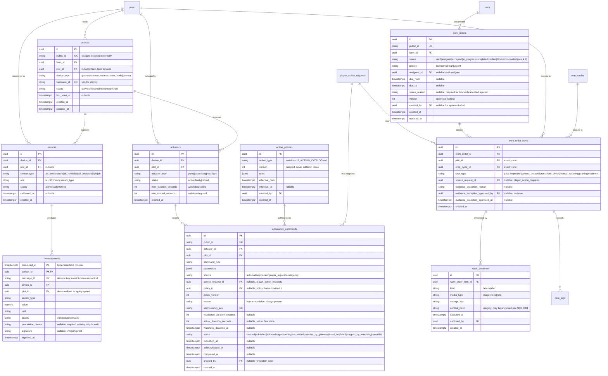

# ERD — Telemetry, Automation, Work Orders

> Week 2 deliverable for issue #7 (`role:khoa`). Entity-relationship design for the
> `telemetry`, `automation`, and `work_orders` modules. This is a **conceptual** ERD:
> the final SQL schema must be created through Alembic migrations
> (`docs/07_DATA_MODEL_GUIDE.md`).
>
> Read alongside: `docs/02_BUSINESS_RULES.md`, `docs/04_DOMAIN_MODEL.md`,
> `docs/07_DATA_MODEL_GUIDE.md` (authoritative table list),
> `docs/15_ACTION_CATALOG.md`, `docs/16_OPERATOR_WORKFLOW.md`,
> `docs/adr/0003-policy-controlled-player-actions.md`, and the contracts in
> `packages/contracts/schemas/`.

Normative keywords `MUST`, `SHOULD`, and `MAY` follow `docs/02_BUSINESS_RULES.md`.

## 1. Scope

This ERD covers the tables owned by the three modules in scope, as named in
`docs/07_DATA_MODEL_GUIDE.md`:

| Module | Tables |
|---|---|
| `telemetry` | `devices`, `sensors`, `actuators`, `measurements` |
| `automation` | `action_policies`, `automation_commands` |
| `work_orders` | `work_orders`, `work_order_items`, `work_evidence` |

Tables owned by other modules (`plots`, `crop_cycles`, `users`,
`player_action_requests`, `care_logs`) appear only as relationship endpoints. No table
outside the list in `07_DATA_MODEL_GUIDE.md` is introduced.

## 2. Diagram



## 3. Telemetry

### 3.1 Device / sensor / actuator split

`devices` is the physical unit that talks MQTT; `sensors` and `actuators` are the
capabilities it exposes. The split matches `07_DATA_MODEL_GUIDE.md` and keeps a single
gateway able to serve several plots.

Watchdog ceilings live on `actuators` (`max_duration_seconds`), not in application
code, so the limit survives a restart and is auditable (`AGENTS.md` §8).

### 3.2 Measurements

`measurements` is the TimescaleDB hypertable, partitioned on `measured_at`. It stores
**one row per measurement**, matching `packages/contracts/schemas/iot-measurement.v1.json`
(one `sensorType` + `value` + `unit` per message), not a batched array.

- Every row MUST carry timestamp, device identity, unit, and quality (`AGENTS.md` §8).
- `message_id` is unique and makes ingest idempotent: a redelivered MQTT message MUST
  NOT create a second row.
- `unit` MUST match `sensor_type` (`07_DATA_MODEL_GUIDE.md`). Enforce in the ingest
  use case and with a check constraint where practical.
- `plot_id` is denormalized from `sensors` because nearly every read is "latest by
  plot" (`telemetry/api/router.py`).

### 3.3 Quarantine

Suspicious or invalid readings MUST NOT be silently treated as valid (`AGENTS.md` §8).
This ERD keeps them **in the same hypertable**, marked by `quality` and explained by
`quarantine_reason`, rather than moving them to a separate table:

- the raw value stays available for AI training and incident forensics;
- `07_DATA_MODEL_GUIDE.md` lists no quarantine table, and this ERD does not invent one.

Every read path that feeds policy decisions, player-facing UI, or automation MUST
filter `quality = 'valid'`. A quarantined row is evidence, not a measurement.

## 4. Work orders

### 4.1 Contract drift — `rejected` is missing from the contract

**This needs a decision from Học before the `work_orders` migration is written**
(Weeks 9-10, "Human work orchestration", `docs/10_ROADMAP_16_WEEKS.md`).

`docs/04_DOMAIN_MODEL.md` lists the WorkOrder alternative states as `rejected`,
`cancelled`, `blocked`. `docs/16_OPERATOR_WORKFLOW.md` documents the transition
`assigned → rejected` (an operator declines an assignment, freeing it for reassignment).

But `packages/contracts/schemas/work-order.v1.json` `status` enum is:

```text
draft | assigned | accepted | in_progress | completed | verified | blocked | cancelled
```

`rejected` is **absent**. The contract and the domain model contradict each other, so
the `status` column above cannot be finalized yet. Options:

1. **Add `rejected` to the contract** — matches `04_DOMAIN_MODEL.md` and the operator
   workflow; requires a `work-order.v1` change (a widened enum is backward-compatible
   for readers, but consumers must handle the new value).
2. **Drop `rejected` from the domain model** — model a declined assignment as
   `assigned → draft` plus a `status_reason`, keeping the contract untouched.

This ERD does not pick a side. Until it is resolved, `work_orders.status` follows the
**contract** (the narrower set), and the drift is tracked in
`docs/13_ASSUMPTIONS_AND_OPEN_QUESTIONS.md` and §6 below.

### 4.2 Order / item split

A work order groups items; each item is bound to **exactly one** `plot_id` and one
`crop_cycle_id` (`07_DATA_MODEL_GUIDE.md`). This is what makes batching safe: one
operator visit can serve many plots while per-plot traceability survives
(`docs/16_OPERATOR_WORKFLOW.md` §7).

`source_request_id` links an item back to the player request that caused it, so a
player can be shown the outcome of their own request.

### 4.3 Evidence

Completion SHOULD include before/after evidence (`docs/02_BUSINESS_RULES.md`). The
evidence exception lives on `work_order_items` — reason, approving reviewer, and
approval time — so a `complete` without evidence is either blocked by
`WORK_ORDER_EVIDENCE_REQUIRED` (`docs/08_CODING_STANDARDS.md`) or carries an explicit,
attributable approval. `content_hash` supports the optional integrity anchoring in
ADR-0004 without putting media on-chain.

## 5. Automation

`automation_commands` records everything ADR-0003 and `AGENTS.md` §8 require to answer
"who caused this actuator to run, under which policy, and what actually happened":

- `source` distinguishes `automation` / `operator` / `player_request` / `emergency`;
- `source_request_id` + `policy_id` + `policy_version` reconstruct the decision, which
  is why `action_policies` is versioned and append-only rather than edited in place;
- `idempotency_key` is unique, so a retried publish cannot double-run a pump;
- `watchdog_deadline_at` makes `stopped_by_watchdog` enforceable by a durable job even
  if the requesting process died;
- `requested_duration_seconds` vs `actual_duration_seconds` exposes the gap between
  intent and reality, which is what `care_logs` and incident review need.

Emergency automation MAY create commands that contradict a player preference
(`AGENTS.md` §2); `source = 'emergency'` and `reason` record why.

## 6. Open questions (for cross-review with Học)

Tracked against `docs/13_ASSUMPTIONS_AND_OPEN_QUESTIONS.md`:

1. **`rejected` in `work-order.v1` (§4.1)** — widen the contract, or drop the state from
   the domain model? Blocks the `work_orders` migration (Weeks 9-10).
2. Quarantined rows in `measurements` vs a separate table (§3.3) — does the AI/infra
   side (Bảo) need them in one hypertable for training, or filtered out at ingest?
3. `measurements` retention and continuous-aggregate policy — how long is raw telemetry
   kept before rollup? Affects hypertable chunk sizing.
4. Do `sensors`/`actuators` need farm-level rows (`plot_id` null), or is every device
   plot-bound in the MVP?
5. Is `care_logs` written by the `work_orders` module on item completion, or by
   `care_logs` itself listening for an event? Ownership boundary with Học.
6. Opaque `public_id` — one shared generator, or per-table? (`07_DATA_MODEL_GUIDE.md`
   requires opaque public identifiers.)
